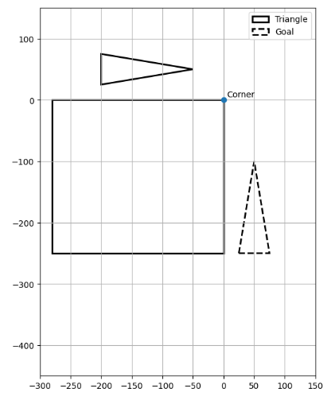
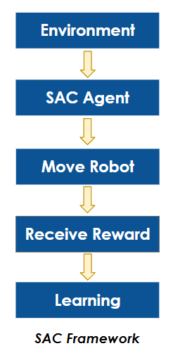
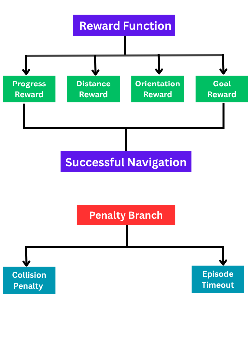

# SAC-Based-Robot-Motion-Planning

Soft Actor-Critic (SAC) based collision-free motion planning for a triangular mobile robot with goal position and orientation control.

---

## Quick Summary

| Item | Description |
|------|-------------|
| Algorithm | Soft Actor-Critic (SAC) |
| Robot | Triangular  Robot |
| Action Space | Continuous |
| Task | Collision-Free Motion Planning |
| Goal | Reach the target position with the desired orientation |

---

## Project Overview

This project presents a reinforcement learning framework for collision-free motion planning using the Soft Actor-Critic (SAC) algorithm.

The objective is to navigate a triangular mobile robot from the start position to the target while avoiding obstacles and achieving the desired final orientation. Instead of relying on predefined trajectories, the agent learns an optimal navigation policy through continuous interaction with the environment and a carefully designed reward function.

---

## Why Reinforcement Learning?

Traditional motion planning methods usually depend on handcrafted rules or predefined paths.

In contrast, reinforcement learning enables the robot to learn collision-free navigation directly through interaction with the environment, allowing the learned policy to adapt to different obstacle configurations without manually redesigning the algorithm.

---

## Project Highlights

- Collision-free trajectory generation
- Soft Actor-Critic (SAC) based continuous control
- Simultaneous position and orientation optimization
- Custom reward function for robot navigation
- Trajectory visualization and animation
- Goal-reaching behavior learned without predefined paths

---

## Final Result

| Metric | Result |
|---------|--------|
| Algorithm | Soft Actor-Critic (SAC) |
| Goal Reached | ✅ Yes |
| Distance Error | **9.89 mm** |
| Orientation Error | **0.46°** |
| Collision | **No** |

---

## Simulation Environment



---

## Trajectory Animation

> Replace the link below with your final animation.

📽️ **Trajectory Animation**

[trajectory_animation.mp4](videos/trajectory_animation.mp4)

---

## SAC Framework



---

## Reward Function



---

## Detailed Documentation

- [Implementation Details](docs/implementation_details.md)
- [Reward Function](docs/reward_function.md)
- [Results and Evaluation](docs/results_and_evaluation.md)
- [Limitations and Future Work](docs/limitations_and_future_work.md)

---

## Repository Structure

```text
SAC-Based-Robot-Motion-Planning/
│
├── docs/
├── images/
├── models/
├── src/
├── trajectories/
├── videos/
├── README.md
└── requirements.txt
```

---

## Installation

```bash
git clone https://github.com/<your-username>/SAC-Based-Robot-Motion-Planning.git

cd SAC-Based-Robot-Motion-Planning

pip install -r requirements.txt
```

---

## Training

```bash
python src/train.py
```

---

## Evaluation

```bash
python src/evaluate.py
```

---

## Future Improvements

- Dynamic obstacle avoidance
- Multiple robot navigation
- Sim-to-real deployment
- Benchmarking with other reinforcement learning algorithms
