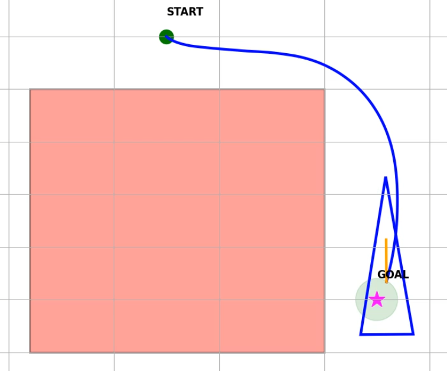

# Results and Evaluation

## Training Summary

The SAC agent was trained through multiple experiments to improve navigation, obstacle avoidance, and final orientation.

Different reward configurations were evaluated until the agent successfully learned to complete the task while satisfying the required goal conditions.

---

## Final Performance

| Metric | Result |
|---------|--------|
| Algorithm | Soft Actor-Critic (SAC) |
| Goal Reached | Yes |
| Distance Error | 9.89 mm |
| Orientation Error | 0.46° |
| Collision | No |

---

## Best Trajectory

The figure below shows the best trajectory generated by the trained agent.

The robot successfully avoided the obstacle, reached the target region, and achieved the desired final orientation.

---

## Trajectory Animation

The complete robot motion can be viewed in the animation below.

📽️ [trajectory_animation.mp4](../videos/trajectory_animation.mp4)

---

## Discussion

The final trained policy demonstrated reliable navigation behaviour in the simulation environment.

Compared with the initial training stages, the final policy produced smoother trajectories, improved obstacle avoidance, and significantly better orientation control near the goal.

The final reward design enabled the robot to satisfy both position and orientation requirements without relying on predefined trajectories.
